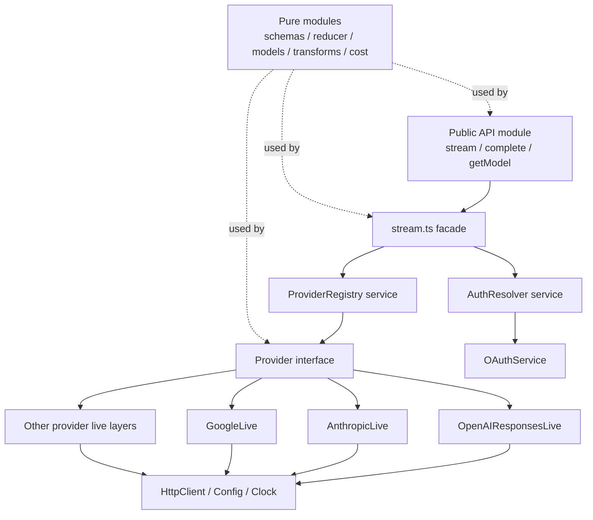

# pi-effect: Project Outline

> Rebuild pi-mono layer by layer using Effect-ts.
> 3 projects, full parity at the end of each.

---

## PROJECT 1 — `@pi-effect/ai`
**Parity target:** `packages/ai/src/`
**Goal:** Unified streaming LLM API across providers.

---

- [x] **1.1 — Canonical Domain + Errors**

**Maps to:** `src/types.ts`, `src/index.ts`
**Build:** Lock the canonical AI language first: `Model`, `Message`, `ContentBlock`, `Tool`, `ToolCall`, `AssistantMessage`, `Usage`, `StopReason`, `StreamEvent`. Keep this slice pure. Add typed error families before any provider work. Do not add HTTP, env, OAuth, registries, or provider SDKs here.

**Files to change/create:**
- change `packages/ai/src/types.ts`
- change `packages/ai/src/index.ts`
- create `packages/ai/src/errors.ts`
- create `packages/ai/src/assistant-events.ts`
- create `packages/ai/src/reduce-assistant-event.ts`

**Effect primitives:**
- `Effect<A,E,R>` as the base model for later slices
- `Schema.Struct`, `Schema.Union`, `Schema.Literal`
- plain `Schema` by default; avoid `Schema.Class` unless the type needs real behavior
- `Data.TaggedError` for `ProviderNotFound`, `AuthMissing`, `ProviderHttpError`, `ProviderProtocolError`, `ToolValidationError`, `Aborted`

**Test:** Round-trip `Model`, `Message[]`, `ToolCall`, `Usage`. Reducer is pure and deterministic for text, thinking, tool call, usage, done, and error events.

---

- [x] **1.2 — Provider Algebra + Public Stream Facade**

**Maps to:** `src/provider.ts`, `src/stream.ts`, `src/index.ts`
**Build:** Define the minimal provider contract and the public exported stream facade. `ProviderRegistry` is the only owned service in this slice. `stream` is primitive. `complete` and `completeSimple` are derived by folding the exact same canonical event stream. Keep the provider error channel honest: provider streams only model provider-originating failures, while registry/facade failures stay outside the provider algebra. Keep this slice provider-agnostic and wire it with one fake provider in tests.

**Adjustment note:** The original plan required a dedicated `AiClient` service here. The implementation showed that a thin `AiClient` layer just re-exported `stream.ts` while still leaking `ProviderRegistry` into every caller. Because `pi-mono` exposes plain module functions at this stage, keep the public API as exported functions for now and defer an injectable `AiClient` until a downstream package actually needs one.

**Files to change/create:**
- create `packages/ai/src/provider.ts`
- create `packages/ai/src/stream.ts`
- create/change `packages/ai/src/utils/assistant-events.ts`
- create `packages/ai/src/utils/event-stream.ts` only if a compatibility wrapper is still needed
- replace any placeholder use of `packages/ai/src/utils/event-streams.ts`
- change `packages/ai/src/index.ts`

**Effect primitives:**
- `ServiceMap.Service` for owned services in v4 beta
- `Layer.succeed` for the first in-memory wiring
- `Effect.fn`, `Effect.gen`
- `Stream<A,E,R>` as the provider return type
- `Stream.runFold` to derive `complete` from `stream`
- `Option` to model "no terminal assistant message yet"

**Test:** A fake provider emits canonical `AssistantMessageEvent`s. Exported `stream` exposes them unchanged. `complete` folds the exact same events into the final `AssistantMessage`. `completeSimple` proves the simple path dispatches to provider `streamSimple`.

---

- [x] **1.3 — OpenAI Responses First Vertical Slice**

**Maps to:** `src/providers/openai-responses.ts`, `src/providers/openai-responses-shared.ts`, `src/stream.ts`
**Build:** Implement exactly one real provider end-to-end: OpenAI Responses. Support text deltas, thinking deltas, tool calls, usage, stop reasons, and folding to a final message. No registry dispatch yet. No OAuth. No Bedrock. No Google.

**Files to change/create:**
- create `packages/ai/src/providers/openai-responses.ts`
- create `packages/ai/src/providers/openai-responses-shared.ts`
- change `packages/ai/src/provider.ts`
- change `packages/ai/src/stream.ts`
- change `packages/ai/src/index.ts`

**Effect primitives:**
- `Layer.effect` for provider construction
- `Effect.tryPromise` with typed error mapping
- `Stream.asyncScoped` for callback / push / SSE bridging when possible
- `Queue` + `Stream.fromQueue` when an explicit mailbox boundary is needed
- `Effect.acquireRelease` only if the provider SDK truly owns lifecycle

**Test:** One mocked OpenAI Responses stream yields canonical events in order. `complete` returns the same final message the reducer would produce. Abort and protocol error paths surface typed errors.

---

- [x] **1.4 — Model Catalog + Provider Registry**

**Maps to:** `src/models.ts`, `src/provider.ts`, `src/providers/register-builtins.ts`
**Build:** After one provider works, keep model lookup pure and split it from provider lookup. `models.ts` owns `getModel / getModels / getProviders / calculateCost` over generated data. `ProviderRegistry` owns provider resolution and built-in wiring. Do not port pi-mono's mutable `api-registry.ts` as a separate file unless runtime extension loading later proves it is needed.

**Files to change/create:**
- change `packages/ai/src/models.ts`
- change `packages/ai/src/provider.ts`
- create `packages/ai/src/providers/register-builtins.ts`
- change `packages/ai/src/providers/openai-responses.ts`
- change `packages/ai/src/stream.ts`
- change `packages/ai/src/index.ts`
- change `packages/ai/scripts/generate-models.ts`

**Effect primitives:**
- `ServiceMap.Service`
- `Layer.succeed`
- `Ref<HashMap<...>>` only if runtime registration is required
- prefer static layer composition for built-ins first

**Test:** `getModel`, `getModels`, `getProviders` work from the pure catalog. Unknown model stays a pure miss (`undefined`), while unknown provider resolves to a typed error via `ProviderRegistry`. Registry dispatch sends OpenAI models to the OpenAI layer. pi-mono has no dedicated catalog test file; parity is exercised indirectly by provider / stream tests plus focused `supportsXhigh` coverage.

---

- [ ] **1.5 — Config + Auth Boundary**

**Maps to:** `src/env-api-keys.ts`, `src/oauth.ts`, `src/clients/openai-client.ts`
**Build:** Move env access and auth lookup behind a typed boundary. Start with env/API key resolution. Keep OAuth behind an interface until the last slice. Do not let provider implementations reach into `process.env` directly. Extract OpenAI SDK construction behind a v4 `ServiceMap.Service` wrapper with named methods like `createResponsesStream(...)`, rather than rebuilding clients ad hoc inside providers.

**Files to change/create:**
- create `packages/ai/src/env-api-keys.ts`
- create `packages/ai/src/auth-resolver.ts`
- create `packages/ai/src/oauth.ts`
- create `packages/ai/src/clients/openai-client.ts`
- create `packages/ai/src/utils/oauth/types.ts`
- change `packages/ai/src/providers/openai-responses.ts`
- change `packages/ai/src/index.ts`

**Effect primitives:**
- `Config`
- `Schema.Config`
- `Config.redacted`
- `Redacted`
- `ServiceMap.Service`
- `Layer.effect`
- `Effect.tryPromise`
- `Effect.orElse`, `Effect.catchTag`
- `@effect/platform` services only at the boundary

**Test:** Reads key from env via typed config. Missing auth is typed. Provider code depends on `AuthResolver` / `OpenAIClient`, not raw env lookup or inline SDK construction.

---

- [ ] **1.6 — Message Transformation Boundary**

**Maps to:** `src/providers/transform-messages.ts`, `src/providers/openai-responses-shared.ts`, `src/providers/google-shared.ts`
**Build:** Keep message conversion pure and isolated. Do not introduce cross-provider replay complexity before a second provider exists. OpenAI conversion can live beside the OpenAI provider first; extract shared transformers only when Anthropic / Google land.

**Files to change/create:**
- create `packages/ai/src/providers/transform-messages.ts`
- create `packages/ai/src/providers/google-shared.ts`
- change `packages/ai/src/providers/openai-responses-shared.ts`
- change `packages/ai/src/providers/openai-responses.ts`

**Effect primitives:**
- pure functions first
- `Schema.encode` / `Schema.decode` for provider payloads
- `Array` utilities from `effect`

**Test:** Tool results, thinking blocks, and replayed conversations transform correctly. Snapshot provider payloads only after canonical reducer tests already pass.

---

- [ ] **1.7 — Provider Expansion + Usage / Overflow**

**Maps to:** provider files under `src/providers/`, `src/utils/overflow.ts`, `src/models.ts`
**Build:** Add the rest of the providers one by one only after the first vertical slice is stable. As each provider lands, keep everything normalized to the same `StreamEvent` union. Add usage aggregation, cost calculation, and overflow classification only after at least two providers share the same reducer path.

**Files to change/create:**
- create `packages/ai/src/providers/anthropic.ts`
- create `packages/ai/src/providers/google.ts`
- create `packages/ai/src/providers/openai-completions.ts`
- create `packages/ai/src/providers/azure-openai-responses.ts`
- create `packages/ai/src/providers/simple-options.ts`
- create `packages/ai/src/utils/overflow.ts`
- change `packages/ai/src/models.ts`
- change `packages/ai/src/provider.ts`
- change `packages/ai/src/providers/register-builtins.ts`
- change `packages/ai/src/index.ts`

**Effect primitives:**
- `Layer.effect`, `Layer.provide`, `Layer.merge`
- `Metric.counter`, `Metric.gauge`
- `Stream.runFold`
- `Effect.withSpan`

**Test:** Provider contract tests per provider. Shared usage/cost/overflow tests run against canonical events instead of provider-specific partial state.

---

- [ ] **1.8 — OAuth + Long-Tail Providers**

**Maps to:** `src/oauth.ts`, `src/utils/oauth/`, long-tail provider files
**Build:** Leave the messy auth and provider tails for last: PKCE, refresh, Copilot, Gemini CLI, Codex, Bedrock, Vertex, Antigravity. By this point the canonical domain, reducer, provider algebra, registry, config, and one-to-many provider path should already be stable.

**Files to change/create:**
- create `packages/ai/src/utils/oauth/index.ts`
- create `packages/ai/src/utils/oauth/pkce.ts`
- create `packages/ai/src/utils/oauth/anthropic.ts`
- create `packages/ai/src/utils/oauth/github-copilot.ts`
- create `packages/ai/src/utils/oauth/google-antigravity.ts`
- create `packages/ai/src/utils/oauth/google-gemini-cli.ts`
- create `packages/ai/src/utils/oauth/openai-codex.ts`
- create `packages/ai/src/providers/google-gemini-cli.ts`
- create `packages/ai/src/providers/openai-codex-responses.ts`
- create `packages/ai/src/providers/google-vertex.ts`
- create `packages/ai/src/providers/amazon-bedrock.ts`
- create `packages/ai/src/providers/github-copilot-headers.ts`
- create `packages/ai/src/bedrock-provider.ts`
- change `packages/ai/src/oauth.ts`
- change `packages/ai/src/provider.ts`
- change `packages/ai/src/providers/register-builtins.ts`
- change `packages/ai/src/index.ts`

**Effect primitives:**
- `Effect.acquireRelease`
- `Schedule.exponential`
- `HttpClient`
- `Layer.effect`

**Test:** Token refresh, retry, re-auth, and provider-specific OAuth flows. Long-tail provider tests only after shared streaming semantics are already stable.

---

### ✅ PROJECT 1 PARITY CHECKLIST
- [ ] All provider SDKs wrapped as Effect Layers
- [ ] Streaming normalised to canonical `StreamEvent` union
- [ ] Auth: env → file → OAuth fallback chain
- [ ] Token usage + cost computed per call
- [ ] Message transformation for all 3 provider families
- [ ] All errors are typed `Data.TaggedError` subtypes
- [ ] `stream` is the primitive API; `complete` is derived by folding canonical events
- [ ] One provider works end-to-end before registry/auth/provider expansion starts

Final Provider File-tree Structure:

packages/ai/src/providers/
  simple-options.ts
  simple-options.test.ts
  transform-messages.ts
  transform-messages.test.ts
  github-copilot-headers.ts
  github-copilot-headers.test.ts

  openai/
    client.ts
    client.test.ts
    responses-shared.ts
    responses-shared.test.ts
    responses.ts
    responses.test.ts
    completions.ts
    completions.test.ts
    azure-client.ts
    azure-client.test.ts
    azure-responses.ts
    azure-responses.test.ts
    codex-client.ts
    codex-client.test.ts
    codex-responses.ts
    codex-responses.test.ts

  google/
    client.ts
    client.test.ts
    shared.ts
    shared.test.ts
    generative-ai.ts
    generative-ai.test.ts
    vertex.ts
    vertex.test.ts
    gemini-cli-client.ts
    gemini-cli-client.test.ts
    gemini-cli.ts
    gemini-cli.test.ts

  anthropic-client.ts
  anthropic-client.test.ts
  anthropic.ts
  anthropic.test.ts

  mistral-client.ts
  mistral-client.test.ts
  mistral.ts
  mistral.test.ts

  bedrock-client.ts
  bedrock-client.test.ts
  amazon-bedrock.ts
  amazon-bedrock.test.ts

  register-builtins.ts


### Project 1 End-State Service Graph

Keep this as the target architecture for `@pi-effect/ai`.
Do not build all of this upfront. Reach it through the vertical slices above.

**Owned services in this package:**
- `ProviderRegistry` — resolve provider implementations and register built-ins
- `AuthResolver` — resolve auth for a provider/model without leaking env/file/OAuth logic
- `OAuthService` — login / refresh / token lifecycle for the providers that need it

**Pure exported catalog module:**
- `models.ts` — `getModel`, `getModels`, `getProviders`, `calculateCost`, `supportsXhigh`

**Public API note:**
- keep the top-level AI facade as plain exported module functions unless a downstream package proves it needs an injected `AiClient` service

**Provider extension point:**
- `Provider` stays a plain interface/algebra, not a top-level business service
- each concrete provider gets its own live layer: `OpenAIResponsesLive`, `AnthropicLive`, `GoogleLive`, `AzureOpenAIResponsesLive`, and long-tail provider layers later

**Pure modules first, not services by default:**
- canonical schemas and domain types
- typed error definitions
- event folding / `reduceAssistantEvent`
- usage + cost calculation
- stop-reason mapping
- message normalization helpers
- provider payload encode/decode helpers
- message transformation logic unless state/config pressure proves it should become a service
- tool validation unless the package later needs multiple swappable validator implementations

**External environment / infra services, not owned business services:**
- `HttpClient`
- `Config`
- `Clock`
- `Random`
- `FileSystem` / `Path`

**Construction rule:**
- user-facing code depends on the public facade; internal wiring composes services
- startup wiring composes layers
- provider layers depend on infra services from the environment
- `complete` stays derived from `stream`



Optional add on:
- [ ] Add support for OpenAI Websocket connections.

---

## PROJECT 2 — `@pi-effect/agent`
**Parity target:** `packages/agent/src/`
**Goal:** Agent loop, tool dispatch, message queue, context management.

---

- [ ] **2.1 — Agent Types**

**Maps to:** `src/types.ts`
**Build:** `AgentContext` (systemPrompt + messages + tools), `ToolDefinition<I,O>`, `AgentEvent` union (text, tool_use, tool_result, done, error), `CompactionEntry`.

**Effect primitives:**
- `Schema.TaggedStruct` — discriminated union events
- `Data.TaggedError` — `ToolError`, `AgentError`, `ContextOverflowError`
- `Chunk<AgentEvent>` — efficient event accumulation

**Test:** Encode/decode a full `AgentContext`. All event variants parse correctly.

---

- [ ] **2.2 — Tool Dispatch**

**Maps to:** `src/agent.ts` (tool execution portion), test `utils/calculate.ts`, `utils/get-current-time.ts`
**Build:** `dispatchTool(def, rawInput)` — validates input via schema, executes, returns stringified result. `ToolRegistry` service holding a map of tools.

**Effect primitives:**
- `Schema.decodeUnknown` — safe runtime input parsing
- `Effect.timeout` — per-tool execution timeout
- `Effect.all({ concurrency })` — parallel tool execution
- `Effect.mapError` — wrap errors in `ToolError`

**Test:** Valid input executes and returns result. Invalid input returns `ParseError`. Timeout fires for slow tools. 2 tools run concurrently.

---

- [ ] **2.3 — The Agent Loop**

**Maps to:** `src/agent-loop.ts`
**Build:** Core loop: send context → collect stream → if tool calls: dispatch all → append results → loop. Otherwise return final message.

```
agentLoop(context, tools, onEvent) → Effect<AssistantMessage, AgentError, LLMProvider>
```

**Effect primitives:**
- `Ref<AgentContext>` — accumulate messages across turns
- `Effect.iterate` / `Effect.loop` — loop until no tool calls
- `Effect.all` with `concurrency: "unbounded"` — parallel tools
- `Stream.runFold` — collect stream into message + tool calls
- `Queue<AgentEvent>` — emit events to caller

**Test:** Agent with a `calculate` tool runs 2 tool turns then returns final text. Events emitted in correct order.

---

- [ ] **2.4 — Message Steering & Interruption**

**Maps to:** `src/agent-loop.ts` (steer/followUp logic), `src/agent.ts`
**Build:** `steer(message)` — interrupt current tool execution, inject message, restart loop. `followUp(message)` — queue message, deliver after agent finishes.

**Effect primitives:**
- `Fiber.interrupt` — cancel in-flight tool execution
- `Effect.fork`, `Fiber.join` — run loop as background fiber
- `Queue.offer` / `Queue.take` — steer message delivery
- `Effect.race` — agent loop vs incoming steer message
- `Deferred` — signal agent completion to waiters

**Test:** Steer mid-tool-execution interrupts and resumes with new message. FollowUp is delivered after all tools finish.

---

- [ ] **2.5 — Agent Class & Public API**

**Maps to:** `src/agent.ts` (the `Agent` class wrapper)
**Build:** `Agent` service wrapping the loop. Methods: `prompt()`, `steer()`, `followUp()`, `clearQueues()`, `abort()`. Exposes `events` stream.

**Effect primitives:**
- `Effect.Service` pattern (class wrapping fibers + queues)
- `PubSub<AgentEvent>` — broadcast events to multiple subscribers
- `Scope` — tie agent lifetime to a scope
- `Effect.scoped` — auto-cleanup on done/error

**Test:** Subscribe two consumers to events. Both receive all events. `abort()` cancels the loop and closes the PubSub.

---

- [ ] **2.6 — Proxy / Transport Abstraction**

**Maps to:** `src/proxy.ts`
**Build:** `AgentTransport` service — decouples agent from how it talks to the LLM. Local = direct `LLMProvider`. Remote = HTTP proxy. Swap via Layer.

**Effect primitives:**
- `HttpClient` from `@effect/platform` — HTTP transport
- `Layer` substitution — swap transport in tests
- `Stream.fromEventSource` — SSE transport for streaming

**Test:** Swap `LocalTransport` for `MockTransport` in tests without changing agent code.

---

### ✅ PROJECT 2 PARITY CHECKLIST
- [ ] Tool dispatch: validation, timeout, parallel execution
- [ ] Agent loop: multi-turn with tool results fed back
- [ ] Steering: interrupt + inject mid-loop
- [ ] FollowUp: queued post-completion delivery
- [ ] Event stream via `PubSub` with multiple consumers
- [ ] Transport layer abstracted behind `AgentTransport` service
- [ ] All test cases from `agent-loop.test.ts` + `agent.test.ts` pass equivalently

Optional add on
- [ ] Add support for durable-stream protocol to client ?

---

## PROJECT 3 — `@pi-effect/coding-agent`
**Parity target:** `packages/coding-agent/src/`
**Goal:** Full CLI coding agent with sessions, tools, extensions, 3 modes.

---

- [ ] **3.1 — Auth Storage**

**Maps to:** `src/core/auth-storage.ts`, test `auth-storage.test.ts`
**Build:** `AuthStorage` service for `~/.pi/agent/auth.json`. Store/retrieve API keys and OAuth tokens. Priority: overrides → file → env.

**Effect primitives:**
- `@effect/platform` `FileSystem` + `Path`
- `Effect.catchTag` — file not found → create empty
- `Ref` — in-memory cache of loaded auth

**Test:** Set key, read it back. In-memory `TestAuthStorage` for unit tests.

---

- [ ] **3.2 — Settings Manager**

**Maps to:** `src/core/settings-manager.ts`, `src/core/resolve-config-value.ts`, tests `settings-manager.test.ts`
**Build:** Cascading settings: defaults < `~/.pi/agent/settings.json` < `.pi/settings.json` < CLI flags. Typed `Settings` schema.

**Effect primitives:**
- `Config` + `ConfigProvider` — load from JSON files
- `Effect.mergeAll` — merge config layers
- `Ref<Settings>` — live settings with hot-reload support

**Test:** CLI flag overrides project setting overrides global. Missing file → use defaults, no error.

---

- [ ] **3.3 — Session Manager (JSONL + Tree)**

**Maps to:** `src/core/session-manager.ts`, `src/core/messages.ts`, all `test/session-manager/` tests
**Build:** Append-only JSONL session files. Each entry has `id` + `parentId`. Methods: `save`, `load`, `branch(fromId)`, `listRecent`, `continueRecent`.

```
~/.pi/agent/sessions/<encoded-cwd>/<uuid>.jsonl
```

**Effect primitives:**
- `Stream.fromReadableStream` + `Stream.splitLines` — JSONL reading
- `Effect.acquireRelease` — file handle open/close
- `Effect.ensuring` — flush on error
- `Ref<SessionTree>` — in-memory tree index

**Test:** Save 5 messages. Load them back. Branch from message 3 → new file with messages 1–3 copied. `listRecent` returns sorted by mtime.

---

- [ ] **3.4 — Model Registry**

**Maps to:** `src/core/model-registry.ts`, `src/core/model-resolver.ts`, tests `model-registry.test.ts`, `model-resolver.test.ts`
**Build:** `ModelRegistry` wrapping `AuthStorage`. `getAvailable()` filters to models with valid API keys. `find(provider, id)` resolves custom models from `models.json`.

**Effect primitives:**
- `Effect.filter` — models with keys
- `Effect.cached` — memoize available models list
- `Layer.effect` with `AuthStorage` dep

**Test:** `getAvailable()` only returns models with valid keys. Custom model from `models.json` resolves. Unknown model → `ModelNotFoundError`.

---

- [ ] **3.5 — File System Tools**

**Maps to:** `src/core/tools/read.ts`, `write.ts`, `edit.ts`, `edit-diff.ts`, `find.ts`, `grep.ts`, `ls.ts` (plus helpers `truncate.ts`, `path-utils.ts`)
**Build:** 7 file-system tools as `ToolDefinition` instances (`read`, `write`, `edit`, `edit-diff`, `find`, `grep`, `ls`). Input validated via Schema. All use `@effect/platform FileSystem`.

Key constraints to match:
- `read`: truncate large files, image support
- `edit`: patch-based, returns diff
- `find`/`grep`: respect `.gitignore`

**Effect primitives:**
- `@effect/platform` `FileSystem`, `Path`
- `Schema.decodeUnknown` — validate tool input
- `Effect.mapError` — map failures to typed file-tool errors
- `Effect.acquireRelease` — temp file cleanup

**Test:** Each tool: happy path + error path. `edit` on non-existent file → `FileNotFoundError`. `find`/`grep` respect `.gitignore`.

---

- [ ] **3.6 — Bash Executor**

**Maps to:** `src/core/bash-executor.ts`, test referenced in `tools.test.ts`
**Build:** Persistent bash session (single shell process, reuse env). Commands streamed, output buffered. Timeout per command.

**Effect primitives:**
- `Effect.acquireRelease` — shell process lifecycle
- `Stream.fromReadableStream` — stdout/stderr as streams
- `Deferred<string>` — signal command completion
- `Semaphore` — one command at a time

**Test:** Run 2 sequential commands in same shell (env var set in cmd1 is visible in cmd2). Timeout kills only the command, not the shell.

---

- [ ] **3.7 — Extension System**

**Maps to:** `src/core/extensions/types.ts`, `loader.ts`, `runner.ts`, `wrapper.ts`, tests `extensions-runner.test.ts`, `extensions-discovery.test.ts`
**Build:** `Extension` interface with lifecycle hooks. `ExtensionLoader` discovers and loads `.ts` files via `jiti`. `ExtensionRunner` fires hooks in order.

Hook events:
- `session:start/end`, `tool:before/after`, `turn:start/end`
- `tool:before` can return `{ block: true }` to cancel

**Effect primitives:**
- `PubSub<HookEvent>` — broadcast to all extensions
- `Effect.forEach` — run hooks sequentially
- `Effect.dynamic import` — `Effect.promise(() => import(path))`
- `Scope` — extension cleanup on session end

**Test:** Hook blocks a tool call. Hook modifies tool result. Two extensions both receive same event.

---

- [ ] **3.8 — Skills System**

**Maps to:** `src/core/skills.ts`, `src/core/resource-loader.ts`, tests `skills.test.ts`, `sdk-skills.test.ts`, fixtures in `test/fixtures/skills/`
**Build:** Skills = markdown files with YAML frontmatter (`name`, `description`). Discovered from: global `~/.pi/agent/skills/`, project `.pi/skills/`, installed packages. Loaded on-demand into system prompt.

**Effect primitives:**
- `Effect.all` with `concurrency: 5` — parallel discovery
- `Effect.cached` — memoize loaded skill content
- `Effect.mapError` — invalid frontmatter → `SkillLoadError`
- `Stream.fromIterable` — iterate skill directories

**Test:** Valid skill loads. Invalid YAML frontmatter → error, not crash. Collision between two skills with same name → project wins.

---

- [ ] **3.9 — System Prompt Builder**

**Maps to:** `src/core/system-prompt.ts`, `src/core/defaults.ts`, test `system-prompt.test.ts`
**Build:** Compose system prompt from: default base, `AGENTS.md` files (walked up from cwd), `SYSTEM.md` (replace or append), active skills, extension injections.

**Effect primitives:**
- `Effect.all` — load all prompt sources in parallel
- `Effect.gen` — compose final string
- `Ref<string[]>` — extensions can append to prompt

**Test:** With `SYSTEM.md` present, base prompt is replaced. `AGENTS.md` in parent dir is included. Skill content appended when loaded.

---

- [ ] **3.10 — Compaction**

**Maps to:** `src/core/compaction/compaction.ts`, `branch-summarization.ts`, `utils.ts`, all `test/compaction*.test.ts`
**Build:** Auto-trigger when context approaches limit. Summarize older messages, keep last N turns. Custom compaction via extensions. Branch summarization for tree sessions.

**Effect primitives:**
- `Effect.when` — conditional compaction trigger
- `Schedule` — retry failed compaction
- `Effect.race` — compaction vs incoming message
- `Chunk.splitAt` — split messages at compaction boundary

**Test:** Context at 90% triggers compaction. Custom extension compaction is called instead of default. Compacted session has correct message count.

---

- [ ] **3.11 — AgentSession (SDK core)**

**Maps to:** `src/core/sdk.ts`, `src/index.ts`, all `test/agent-session-*.test.ts`
**Build:** `AgentSession` — the top-level object tying everything together. Methods: `prompt()`, `branch()`, `compact()`, `setModel()`, `on(event, handler)`. Created via `createAgentSession(options)`.

**Effect primitives:**
- `Effect.Service` with full composition
- `Layer.mergeAll` — compose all subsystems
- `ManagedRuntime` — reuse runtime across prompts
- `Effect.addFinalizer` — session cleanup

**Test:** Full integration: prompt → tool call → tool result → final response. Branch from turn 2 → independent history. Auto-compaction triggers at limit.

---

- [ ] **3.12 — Print Mode**

**Maps to:** `src/modes/print-mode.ts`
**Build:** `-p "message"` flag. Run agent once, stream output to stdout. `--mode json` emits newline-delimited JSON events.

**Effect primitives:**
- `@effect/platform` `Stdout`
- `Stream.tap(event => console.log)` 
- `Effect.scoped` — cleanup after single run

**Test:** Run with mock agent. Assert stdout contains streamed text. `--mode json` output parses as valid JSON events.

---

- [ ] **3.13 — RPC Mode**

**Maps to:** `src/modes/rpc/rpc-types.ts`, `rpc-mode.ts`, `rpc-client.ts`, test `rpc.test.ts`, example `test/rpc-example.ts`
**Build:** JSON protocol over stdin/stdout. Events: `message`, `tool_use`, `tool_result`, `steer`, `done`, `error`. Bidirectional: client sends user messages and tool approvals.

**Effect primitives:**
- `Stream.fromReadableStream` + `Stream.splitLines` — JSONL stdin
- `Channel` — bidirectional stdin/stdout
- `Queue` — buffer incoming RPC messages
- `Effect.fork` — concurrent read loop + agent loop

**Test:** Send message over stdin pipe. Receive streamed events on stdout. Send steer mid-stream → agent redirects.

---

- [ ] **3.14 — Interactive Mode (TUI)**

**Maps to:** `src/modes/interactive/` (all components), `src/core/keybindings.ts`, `src/core/event-bus.ts`
**Build:** Terminal UI. Reuse `pi-tui` primitives (or port key ones). Components: editor, message list, tool execution display, model selector, session picker, footer.

**Effect primitives:**
- `Terminal` from `@effect/platform`
- `Fiber` orchestration: input fiber + render fiber + agent fiber
- `PubSub<UIEvent>` — event bus across components
- `Effect.never` + `Effect.race` — blocking on user input
-  OpenTUI

**Test (lighter):** Editor accepts input. Ctrl+C sends interrupt. `/model` command triggers model selector overlay.

---

- [ ] ** 3.15 — CLI Entry Point & Args**

**Maps to:** `src/main.ts`, `src/cli/args.ts`, tests `args.test.ts`
**Build:** Parse CLI args → route to correct mode. Handle: `-p`, `--mode`, `-c` (continue), `-r` (session picker), `--session`, `--no-session`, `pi install/remove/list/update` package commands.

**Effect primitives:**
- `@effect/cli` — `Command`, `Options`, `Args`
- `Effect.matchCauseEffect` — top-level error handler
- `BunRuntime.runMain` — signal handling, exit codes
- `Layer` — full app layer composed here

**Test:** Each CLI flag routes to correct mode. Unknown flag → help text. `pi install` runs without starting agent.

---

### ✅ PROJECT 3 PARITY CHECKLIST
- [ ] All 7 file tools with correct error types
- [ ] Persistent bash session with timeout
- [ ] Sessions: JSONL, branching, tree navigation
- [ ] Settings: full cascade, in-memory for tests  
- [ ] Extensions: discovery, loading, hook interception
- [ ] Skills: discovery, collision handling, on-demand loading
- [ ] System prompt: AGENTS.md walk, SYSTEM.md replace/append
- [ ] Compaction: auto-trigger, custom extension, branch
- [ ] `AgentSession`: all test scenarios from `test/agent-session-*.test.ts`
- [ ] Print mode + JSON mode
- [ ] RPC mode: full bidirectional protocol
- [ ] Interactive TUI: editor, streaming, overlays
- [ ] CLI: all flags, all subcommands

Optional Add ons:
- [ ] Make HTTP Server Mode with Durable Streams with OpenAPI. 
- [ ] Add SDK with Hey. 
- [ ] Build seperate TUI with SDK.
- [ ] Add Git-AI Blame and link conversations with diffs. 
- [ ] Add Remote code.storage 
- [ ] Add Multi Personal
- [ ] Add Permissions with TOOLS, RBAC, FGA. Auth as someone and autonoumous.
- [ ] Add Control Plane.

---

## Effect Primitives Master Reference

| Primitive | Introduced in |
|---|---|
| `Effect<A,E,R>`, `Schema.Struct/Union/Literal`, `Data.TaggedError` | 1.1 |
| `ServiceMap.Service`, `Layer.succeed`, `Effect.fn`, `Effect.gen`, `Option` | 1.2 |
| `Stream<A,E,R>`, `Stream.runFold` | 1.2 |
| `Layer.effect`, `Effect.tryPromise`, `Stream.asyncScoped`, `Stream.fromQueue` | 1.3 |
| `Ref<A>` | 1.4 |
| `Config`, `Schema.Config`, `ConfigProvider`, `Effect.orElse/catchTag` | 1.5 |
| `Schema.encode/decode` | 1.6 |
| `Metric.counter/gauge` | 1.7 |
| `Effect.withSpan`, `Tracer` | 1.7 |
| `HttpClient` | 1.8 |
| `Effect.all({ concurrency })` | 2.2 |
| `Effect.timeout` | 2.2 |
| `Effect.iterate/loop` | 2.3 |
| `Queue<A>` | 2.3 |
| `Fiber`, `Effect.fork`, `Fiber.interrupt` | 2.4 |
| `Effect.race` | 2.4 |
| `Deferred<A>` | 2.4 |
| `PubSub<A>` | 2.5 |
| `Effect.scoped`, `Scope` | 2.5 |
| `Semaphore` | 3.6 |
| `Effect.when` | 3.10 |
| `Schedule` | 3.10 |
| `ManagedRuntime` | 3.11 |
| `@effect/cli` `Command/Options/Args` | 3.15 |
| `BunRuntime.runMain` | 3.15 |
| `Channel` | 3.13 |

---

## Parity Execution Map (Function + Test Driven)

Use this section as the implementation contract for each checklist step.
For every step:
1. Read the listed `pi-mono` functions first.
2. Recreate equivalent behavior in `pi-effect` files listed under "Required output files".
3. Port/add the listed tests before marking the step complete.

### Project 1 (`@pi-effect/ai`)

- **1.1 Canonical Domain + Errors**
  - `pi-mono` functions/types: `packages/ai/src/types.ts` (`KnownApi`, `KnownProvider`, `Message`, `Tool`, `Model`, `AssistantMessageEvent`), `packages/ai/src/utils/event-stream.ts` (event/result split).
  - Parity tests to port/run: `packages/ai/test/stream.test.ts`, `empty.test.ts`, `unicode-surrogate.test.ts`.
  - Required output files in `pi-effect`: `packages/ai/src/types.ts`, `packages/ai/src/errors.ts`, `packages/ai/src/assistant-events.ts`, `packages/ai/src/reduce-assistant-event.ts`, `packages/ai/src/index.ts`.

- **1.2 Provider Algebra + Public Stream Facade**
  - `pi-mono` functions/classes: `stream`, `streamSimple` (`stream.ts`), `EventStream`, `AssistantMessageEventStream`, `createAssistantMessageEventStream` (`utils/event-stream.ts`).
  - Parity tests to port/run: `packages/ai/test/stream.test.ts`, `abort.test.ts`, `empty.test.ts`.
  - Required output files in `pi-effect`: `packages/ai/src/provider.ts`, `packages/ai/src/stream.ts`, `packages/ai/src/utils/assistant-events.ts`, optional `packages/ai/src/utils/event-stream.ts`, `packages/ai/src/index.ts`.

- **1.3 OpenAI Responses First Vertical Slice**
  - `pi-mono` functions: `streamOpenAIResponses`, `streamSimpleOpenAIResponses` (`providers/openai-responses.ts`), `convertResponsesMessages`, `convertResponsesTools`, `processResponsesStream` (`providers/openai-responses-shared.ts`), `parseStreamingJson` (`utils/json-parse.ts`).
  - Parity tests to port/run: `packages/ai/test/stream.test.ts`, `interleaved-thinking.test.ts`, `abort.test.ts`.
  - Required output files in `pi-effect`: `packages/ai/src/providers/openai-responses.ts`, `packages/ai/src/providers/openai-responses-shared.ts`, `packages/ai/src/utils/json-parse.ts`, plus adjustments in `packages/ai/src/provider.ts`, `packages/ai/src/stream.ts`.

- **1.4 Model Catalog + Provider Registry**
  - `pi-mono` functions: `registerApiProvider`, `getApiProvider`, `getApiProviders`, `unregisterApiProviders`, `clearApiProviders` (`api-registry.ts`), `getModel`, `getProviders`, `getModels`, `calculateCost` (`models.ts`), `registerBuiltInApiProviders`, `resetApiProviders` (`providers/register-builtins.ts`).
  - `pi-effect` absorption note: the mutable `api-registry.ts` surface is intentionally absorbed into `ProviderRegistry` in `provider.ts`; the model catalog remains a pure exported module.
  - Parity tests to port/run: `packages/ai/test/bedrock-models.test.ts`, `supports-xhigh.test.ts`, `zen.test.ts`. pi-mono has no dedicated catalog test file.
  - Required output files in `pi-effect`: `packages/ai/src/provider.ts`, `packages/ai/src/models.ts`, `packages/ai/src/providers/register-builtins.ts`, plus wiring changes in `packages/ai/src/stream.ts`, `packages/ai/src/index.ts`, and `packages/ai/scripts/generate-models.ts`.

- **1.5 Config + Auth Boundary**
  - `pi-mono` functions: `getEnvApiKey` (`env-api-keys.ts`), `getOAuthApiKey`, `refreshOAuthToken`, `registerOAuthProvider`, `getOAuthProvider` (`utils/oauth/index.ts`).
  - Parity tests to port/run: `packages/ai/test/oauth.ts`, plus auth-sensitive flows in `stream.test.ts`.
  - Required output files in `pi-effect`: `packages/ai/src/env-api-keys.ts`, `packages/ai/src/auth-resolver.ts`, `packages/ai/src/oauth.ts`, `packages/ai/src/utils/oauth/types.ts`.

- **1.6 Message Transformation Boundary**
  - `pi-mono` functions: `transformMessages`, `convertResponsesMessages`, `convertResponsesTools`, `convertMessages` (`openai-completions.ts`), `convertTools`, `mapToolChoice`, `mapStopReason` (`google-shared.ts`).
  - Parity tests to port/run: `transform-messages-copilot-openai-to-anthropic.test.ts`, `google-tool-call-missing-args.test.ts`, `tool-call-without-result.test.ts`, `image-tool-result.test.ts`.
  - Required output files in `pi-effect`: `packages/ai/src/providers/transform-messages.ts`, `packages/ai/src/providers/openai-responses-shared.ts`, `packages/ai/src/providers/google-shared.ts`.

- **1.7 Provider Expansion + Usage / Overflow**
  - `pi-mono` functions: `streamAnthropic`, `streamOpenAICompletions`, `streamGoogle`, `streamAzureOpenAIResponses`, `calculateCost`, `supportsXhigh`, `isContextOverflow`, `getOverflowPatterns`.
  - Parity tests to port/run: `stream.test.ts`, `tokens.test.ts`, `total-tokens.test.ts`, `context-overflow.test.ts`, `cache-retention.test.ts`, `xhigh.test.ts`, `supports-xhigh.test.ts`.
  - Required output files in `pi-effect`: `packages/ai/src/providers/anthropic.ts`, `packages/ai/src/providers/google.ts`, `packages/ai/src/providers/openai-completions.ts`, `packages/ai/src/providers/azure-openai-responses.ts`, `packages/ai/src/providers/simple-options.ts`, `packages/ai/src/utils/overflow.ts`, plus updates in `packages/ai/src/models.ts`, `packages/ai/src/provider.ts`, `packages/ai/src/providers/register-builtins.ts`.

- **1.8 OAuth + Long-Tail Providers**
  - `pi-mono` functions: provider login/refresh flows in `utils/oauth/anthropic.ts`, `github-copilot.ts`, `google-gemini-cli.ts`, `openai-codex.ts`, plus `generatePKCE` (`pkce.ts`), plus `streamGoogleVertex`, `streamOpenAICodexResponses`, `streamBedrock`.
  - Parity tests to port/run: `oauth.ts`, `github-copilot-anthropic.test.ts`, `google-gemini-cli-empty-stream.test.ts`, `google-gemini-cli-retry-delay.test.ts`, `google-gemini-cli-claude-thinking-header.test.ts`, `openai-codex-stream.test.ts`, `cross-provider-handoff.test.ts`, `tool-call-id-normalization.test.ts`, `bedrock-models.test.ts`.
  - Required output files in `pi-effect`: `packages/ai/src/utils/oauth/*.ts`, `packages/ai/src/providers/google-gemini-cli.ts`, `packages/ai/src/providers/openai-codex-responses.ts`, `packages/ai/src/providers/google-vertex.ts`, `packages/ai/src/providers/amazon-bedrock.ts`, `packages/ai/src/providers/github-copilot-headers.ts`, `packages/ai/src/bedrock-provider.ts`.

### Project 2 (`@pi-effect/agent`)

- **2.1 Agent Types**
  - `pi-mono` functions/types: `AgentLoopConfig`, `AgentContext`, `AgentEvent`, `AgentTool` (`packages/agent/src/types.ts`).
  - Parity tests to port/run: `packages/agent/test/agent-loop.test.ts`, `agent.test.ts`.
  - Required output files in `pi-effect`: `packages/agent/src/types.ts`.

- **2.2 Tool Dispatch**
  - `pi-mono` implementation focus: tool validation/execution flow inside `packages/agent/src/agent.ts` (`Agent` internals).
  - Parity tests to port/run: `packages/agent/test/agent.test.ts` + `test/utils/calculate.ts`, `test/utils/get-current-time.ts`.
  - Required output files in `pi-effect`: `packages/agent/src/agent.ts`.

- **2.3 The Agent Loop**
  - `pi-mono` functions: `agentLoop`, `agentLoopContinue` (`packages/agent/src/agent-loop.ts`).
  - Parity tests to port/run: `packages/agent/test/agent-loop.test.ts`.
  - Required output files in `pi-effect`: `packages/agent/src/agent-loop.ts`.

- **2.4 Message Steering & Interruption**
  - `pi-mono` implementation focus: interrupt/continue behavior in `agent.ts` + `agent-loop.ts`.
  - Parity tests to port/run: `packages/agent/test/e2e.test.ts` (continue + interruption behavior).
  - Required output files in `pi-effect`: `packages/agent/src/agent.ts`, `packages/agent/src/agent-loop.ts`.

- **2.5 Agent Class & Public API**
  - `pi-mono` symbols: `AgentOptions`, `Agent` class (`packages/agent/src/agent.ts`).
  - Parity tests to port/run: `packages/agent/test/agent.test.ts`, `e2e.test.ts`.
  - Required output files in `pi-effect`: `packages/agent/src/agent.ts`, `packages/agent/src/index.ts`.

- **2.6 Proxy / Transport Abstraction**
  - `pi-mono` symbols: `ProxyStreamOptions`, `streamProxy` (`packages/agent/src/proxy.ts`).
  - Parity tests to port/run: add dedicated proxy tests + cover proxy path in `e2e.test.ts` equivalent.
  - Required output files in `pi-effect`: `packages/agent/src/proxy.ts`.

### Project 3 (`@pi-effect/coding-agent`)

- **3.1 Auth Storage**
  - `pi-mono` symbols: `FileAuthStorageBackend`, `InMemoryAuthStorageBackend`, `AuthStorage` (`core/auth-storage.ts`).
  - Parity tests to port/run: `auth-storage.test.ts`.
  - Required output files in `pi-effect`: `packages/coding-agent/src/core/auth-storage.ts`.

- **3.2 Settings Manager**
  - `pi-mono` symbols: `SettingsManager`, `FileSettingsStorage`, `InMemorySettingsStorage` (`core/settings-manager.ts`), `resolveConfigValue`, `resolveHeaders`, `clearConfigValueCache` (`core/resolve-config-value.ts`).
  - Parity tests to port/run: `settings-manager.test.ts`, `settings-manager-bug.test.ts`.
  - Required output files in `pi-effect`: `packages/coding-agent/src/core/settings-manager.ts`, `packages/coding-agent/src/core/resolve-config-value.ts`.

- **3.3 Session Manager (JSONL + Tree)**
  - `pi-mono` symbols: `SessionManager`, `parseSessionEntries`, `migrateSessionEntries`, `buildSessionContext`, `loadEntriesFromFile`, `findMostRecentSession` (`core/session-manager.ts`).
  - Parity tests to port/run: all files under `test/session-manager/`, plus `session-info-modified-timestamp.test.ts`.
  - Required output files in `pi-effect`: `packages/coding-agent/src/core/session-manager.ts`, `packages/coding-agent/src/core/messages.ts`.

- **3.4 Model Registry**
  - `pi-mono` symbols: `ModelRegistry`, `clearApiKeyCache` (`core/model-registry.ts`), `parseModelPattern`, `resolveCliModel` (`core/model-resolver.ts`).
  - Parity tests to port/run: `model-registry.test.ts`, `model-resolver.test.ts`.
  - Required output files in `pi-effect`: `packages/coding-agent/src/core/model-registry.ts`, `packages/coding-agent/src/core/model-resolver.ts`.

- **3.5 File System Tools**
  - `pi-mono` symbols: `createReadTool`, `createWriteTool`, `createEditTool`, `detectLineEnding`, `fuzzyFindText`, `createFindTool`, `createGrepTool`, `createLsTool`, `createAllTools`, `resolveReadPath`, `truncateHead`, `truncateTail`.
  - Parity tests to port/run: `tools.test.ts`, `path-utils.test.ts`, `truncate-to-width.test.ts`.
  - Required output files in `pi-effect`: `packages/coding-agent/src/core/tools/read.ts`, `write.ts`, `edit.ts`, `edit-diff.ts`, `find.ts`, `grep.ts`, `ls.ts`, `index.ts`, `path-utils.ts`, `truncate.ts`.

- **3.6 Bash Executor**
  - `pi-mono` symbols: `executeBash` (`core/bash-executor.ts`), `createBashTool` (`core/tools/bash.ts`).
  - Parity tests to port/run: bash sections in `tools.test.ts`.
  - Required output files in `pi-effect`: `packages/coding-agent/src/core/bash-executor.ts`, `packages/coding-agent/src/core/tools/bash.ts`.

- **3.7 Extension System**
  - `pi-mono` symbols: `createExtensionRuntime` (`core/extensions/loader.ts`), `ExtensionRunner` (`core/extensions/runner.ts`), `wrapToolWithExtensions` / `wrapToolsWithExtensions` (`core/extensions/wrapper.ts`), extension contracts in `core/extensions/types.ts`.
  - Parity tests to port/run: `extensions-runner.test.ts`, `extensions-discovery.test.ts`, `extensions-input-event.test.ts`.
  - Required output files in `pi-effect`: `packages/coding-agent/src/core/extensions/types.ts`, `loader.ts`, `runner.ts`, `wrapper.ts`.

- **3.8 Skills System**
  - `pi-mono` symbols: `loadSkillsFromDir`, `formatSkillsForPrompt`, `loadSkills` (`core/skills.ts`), `DefaultResourceLoader` (`core/resource-loader.ts`).
  - Parity tests to port/run: `skills.test.ts`, `sdk-skills.test.ts`, `resource-loader.test.ts`, `frontmatter.test.ts`.
  - Required output files in `pi-effect`: `packages/coding-agent/src/core/skills.ts`, `resource-loader.ts`, `diagnostics.ts`, `utils/frontmatter.ts`.

- **3.9 System Prompt Builder**
  - `pi-mono` symbols: `buildSystemPrompt` (`core/system-prompt.ts`), defaults/constants in `core/defaults.ts`, template helpers in `core/prompt-templates.ts`.
  - Parity tests to port/run: `system-prompt.test.ts`, `prompt-templates.test.ts`.
  - Required output files in `pi-effect`: `packages/coding-agent/src/core/system-prompt.ts`, `defaults.ts`, `prompt-templates.ts`.

- **3.10 Compaction**
  - `pi-mono` symbols: `shouldCompact`, `findCutPoint`, `prepareCompaction`, `compact` (`core/compaction/compaction.ts`), `collectEntriesForBranchSummary`, `prepareBranchEntries`, `generateBranchSummary` (`branch-summarization.ts`), file-op helpers in `compaction/utils.ts`.
  - Parity tests to port/run: `compaction.test.ts`, `compaction-extensions.test.ts`, `compaction-extensions-example.test.ts`, `compaction-summary-reasoning.test.ts`, `compaction-thinking-model.test.ts`.
  - Required output files in `pi-effect`: all files under `packages/coding-agent/src/core/compaction/`.

- **3.11 AgentSession (SDK core)**
  - `pi-mono` symbols: `AgentSession`, `parseSkillBlock` (`core/agent-session.ts`), `createAgentSession` + SDK types (`core/sdk.ts`).
  - Parity tests to port/run: `agent-session-*.test.ts` (all), including `agent-session-dynamic-tools.test.ts` and `agent-session-retry.test.ts`.
  - Required output files in `pi-effect`: `packages/coding-agent/src/core/agent-session.ts`, `packages/coding-agent/src/core/sdk.ts`, `packages/coding-agent/src/index.ts`.

- **3.12 Print Mode**
  - `pi-mono` symbols: `runPrintMode`, `PrintModeOptions` (`modes/print-mode.ts`).
  - Parity tests to port/run: add/port print-mode tests (plus arg routing assertions in `args.test.ts`).
  - Required output files in `pi-effect`: `packages/coding-agent/src/modes/print-mode.ts`.

- **3.13 RPC Mode**
  - `pi-mono` symbols: `runRpcMode` (`modes/rpc/rpc-mode.ts`), `RpcClient` (`rpc-client.ts`), command/response unions in `rpc-types.ts`.
  - Parity tests to port/run: `rpc.test.ts`, `rpc-example.ts`.
  - Required output files in `pi-effect`: `packages/coding-agent/src/modes/rpc/rpc-mode.ts`, `rpc-client.ts`, `rpc-types.ts`.

- **3.14 Interactive Mode (TUI)**
  - `pi-mono` symbols: `InteractiveMode` (`modes/interactive/interactive-mode.ts`), plus key infrastructure in `core/keybindings.ts`, `core/event-bus.ts`.
  - Parity tests to port/run: `interactive-mode-status.test.ts`, `tree-selector.test.ts`, `tool-execution-component.test.ts`, `session-selector-*.test.ts`, `test-theme-colors.ts`.
  - Required output files in `pi-effect`: `packages/coding-agent/src/modes/interactive/interactive-mode.ts`, `packages/coding-agent/src/modes/interactive/components/*`, `packages/coding-agent/src/modes/interactive/theme/*`, `packages/coding-agent/src/core/keybindings.ts`, `packages/coding-agent/src/core/event-bus.ts`.

- **3.15 CLI Entry Point & Args**
  - `pi-mono` symbols: `parseArgs`, `printHelp` (`cli/args.ts`), `main` (`main.ts`), startup migration functions (`migrations.ts`), package/resource integration (`core/package-manager.ts`, `core/resource-loader.ts`).
  - Parity tests to port/run: `args.test.ts`, `package-command-paths.test.ts`, `package-manager.test.ts`, `package-manager-ssh.test.ts`, `git-update.test.ts`.
  - Required output files in `pi-effect`: `packages/coding-agent/src/cli.ts`, `packages/coding-agent/src/main.ts`, `packages/coding-agent/src/cli/args.ts`, `packages/coding-agent/src/cli/file-processor.ts`, `packages/coding-agent/src/cli/session-picker.ts`, `packages/coding-agent/src/cli/list-models.ts`, `packages/coding-agent/src/cli/config-selector.ts`, `packages/coding-agent/src/core/package-manager.ts`, `packages/coding-agent/src/migrations.ts`, `packages/coding-agent/src/core/timings.ts`.

---

## Source File Manifest (pi-mono parity reference)

These are the source files currently present in `pi-mono`; use them as the authoritative parity list.

### `@pi-effect/ai` expected `src/` files
```txt
src/models.ts
src/index.ts
src/models.generated.ts
src/api-registry.ts
src/types.ts
src/stream.ts
src/bedrock-provider.ts
src/utils/json-parse.ts
src/utils/overflow.ts
src/utils/event-stream.ts
src/utils/sanitize-unicode.ts
src/utils/oauth/pkce.ts
src/utils/oauth/index.ts
src/utils/oauth/github-copilot.ts
src/utils/oauth/types.ts
src/utils/oauth/google-antigravity.ts
src/utils/oauth/google-gemini-cli.ts
src/utils/oauth/openai-codex.ts
src/utils/oauth/anthropic.ts
src/utils/typebox-helpers.ts
src/utils/validation.ts
src/env-api-keys.ts
src/cli.ts
src/oauth.ts
src/providers/amazon-bedrock.ts
src/providers/openai-responses-shared.ts
src/providers/register-builtins.ts
src/providers/google-shared.ts
src/providers/google.ts
src/providers/azure-openai-responses.ts
src/providers/google-vertex.ts
src/providers/transform-messages.ts
src/providers/google-gemini-cli.ts
src/providers/openai-codex-responses.ts
src/providers/anthropic.ts
src/providers/openai-completions.ts
src/providers/github-copilot-headers.ts
src/providers/openai-responses.ts
src/providers/simple-options.ts
```

### `@pi-effect/agent` expected `src/` files
```txt
src/agent-loop.ts
src/index.ts
src/proxy.ts
src/types.ts
src/agent.ts
```

### `@pi-effect/coding-agent` expected `src/` files
```txt
src/config.ts
src/index.ts
src/cli/session-picker.ts
src/cli/config-selector.ts
src/cli/list-models.ts
src/cli/args.ts
src/cli/file-processor.ts
src/utils/tools-manager.ts
src/utils/mime.ts
src/utils/git.ts
src/utils/frontmatter.ts
src/utils/shell.ts
src/utils/image-resize.ts
src/utils/changelog.ts
src/utils/clipboard-image.ts
src/utils/sleep.ts
src/utils/clipboard.ts
src/utils/image-convert.ts
src/utils/clipboard-native.ts
src/utils/photon.ts
src/cli.ts
src/migrations.ts
src/modes/rpc/rpc-mode.ts
src/modes/rpc/rpc-types.ts
src/modes/rpc/rpc-client.ts
src/modes/index.ts
src/modes/interactive/theme/dark.json
src/modes/interactive/theme/theme.ts
src/modes/interactive/theme/light.json
src/modes/interactive/theme/theme-schema.json
src/main.ts
src/modes/print-mode.ts
src/modes/interactive/interactive-mode.ts
src/modes/interactive/components/diff.ts
src/modes/interactive/components/user-message-selector.ts
src/modes/interactive/components/oauth-selector.ts
src/modes/interactive/components/bordered-loader.ts
src/modes/interactive/components/user-message.ts
src/modes/interactive/components/theme-selector.ts
src/modes/interactive/components/thinking-selector.ts
src/modes/interactive/components/extension-selector.ts
src/modes/interactive/components/config-selector.ts
src/modes/interactive/components/extension-editor.ts
src/modes/interactive/components/visual-truncate.ts
src/modes/interactive/components/countdown-timer.ts
src/modes/interactive/components/show-images-selector.ts
src/modes/interactive/components/footer.ts
src/modes/interactive/components/login-dialog.ts
src/modes/interactive/components/assistant-message.ts
src/modes/interactive/components/daxnuts.ts
src/modes/interactive/components/skill-invocation-message.ts
src/modes/interactive/components/tool-execution.ts
src/modes/interactive/components/bash-execution.ts
src/modes/interactive/components/tree-selector.ts
src/modes/interactive/components/custom-message.ts
src/modes/interactive/components/index.ts
src/modes/interactive/components/session-selector-search.ts
src/modes/interactive/components/dynamic-border.ts
src/modes/interactive/components/armin.ts
src/modes/interactive/components/keybinding-hints.ts
src/modes/interactive/components/settings-selector.ts
src/modes/interactive/components/scoped-models-selector.ts
src/modes/interactive/components/session-selector.ts
src/modes/interactive/components/model-selector.ts
src/modes/interactive/components/custom-editor.ts
src/modes/interactive/components/extension-input.ts
src/modes/interactive/components/branch-summary-message.ts
src/modes/interactive/components/compaction-summary-message.ts
src/core/model-registry.ts
src/core/package-manager.ts
src/core/agent-session.ts
src/core/sdk.ts
src/core/event-bus.ts
src/core/footer-data-provider.ts
src/core/export-html/vendor/highlight.min.js
src/core/export-html/vendor/marked.min.js
src/core/export-html/template.js
src/core/export-html/index.ts
src/core/export-html/template.html
src/core/export-html/template.css
src/core/export-html/ansi-to-html.ts
src/core/export-html/tool-renderer.ts
src/core/skills.ts
src/core/index.ts
src/core/keybindings.ts
src/core/diagnostics.ts
src/core/exec.ts
src/core/timings.ts
src/core/session-manager.ts
src/core/system-prompt.ts
src/core/extensions/runner.ts
src/core/extensions/wrapper.ts
src/core/extensions/index.ts
src/core/extensions/types.ts
src/core/extensions/loader.ts
src/core/compaction/index.ts
src/core/compaction/branch-summarization.ts
src/core/compaction/utils.ts
src/core/compaction/compaction.ts
src/core/prompt-templates.ts
src/core/auth-storage.ts
src/core/resource-loader.ts
src/core/bash-executor.ts
src/core/slash-commands.ts
src/core/messages.ts
src/core/settings-manager.ts
src/core/defaults.ts
src/core/tools/truncate.ts
src/core/tools/edit-diff.ts
src/core/tools/write.ts
src/core/tools/index.ts
src/core/tools/bash.ts
src/core/tools/edit.ts
src/core/tools/grep.ts
src/core/tools/ls.ts
src/core/tools/path-utils.ts
src/core/tools/find.ts
src/core/tools/read.ts
src/core/resolve-config-value.ts
src/core/model-resolver.ts
```
